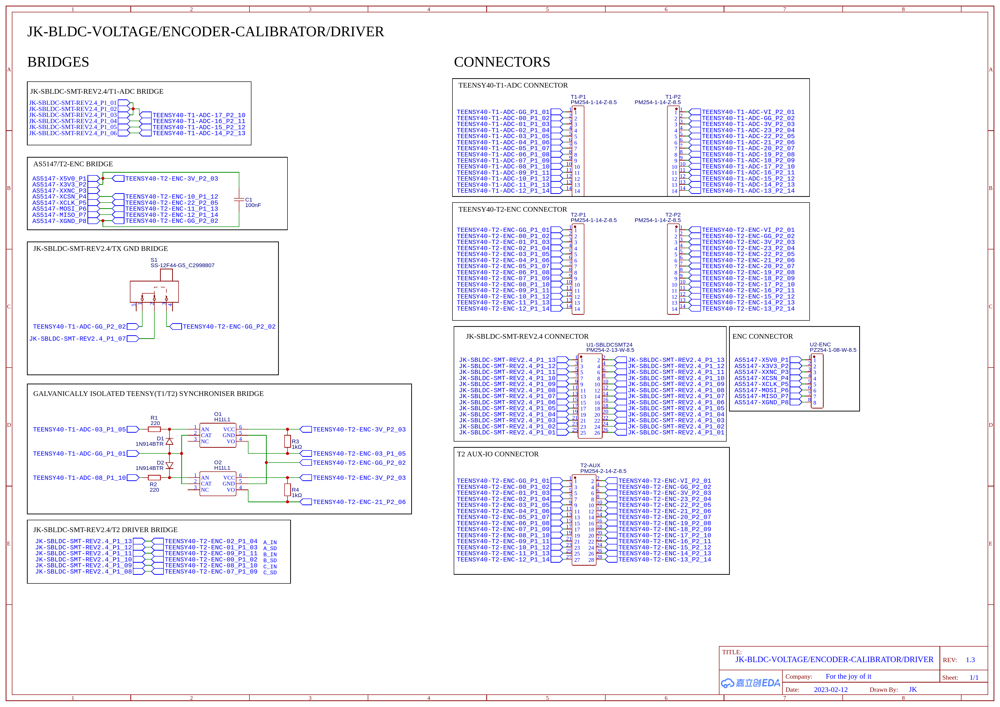
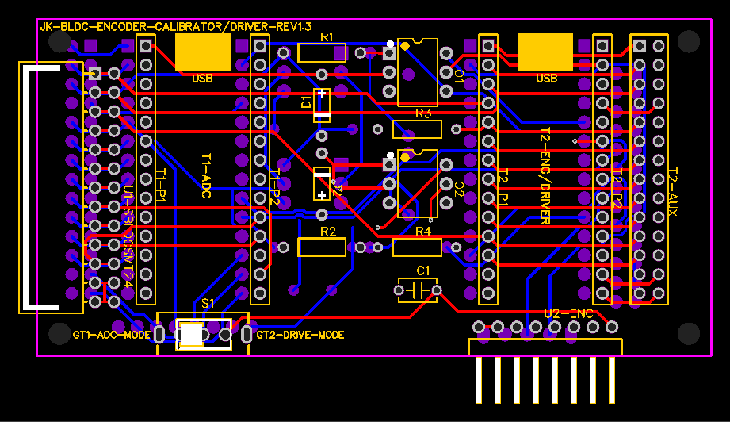
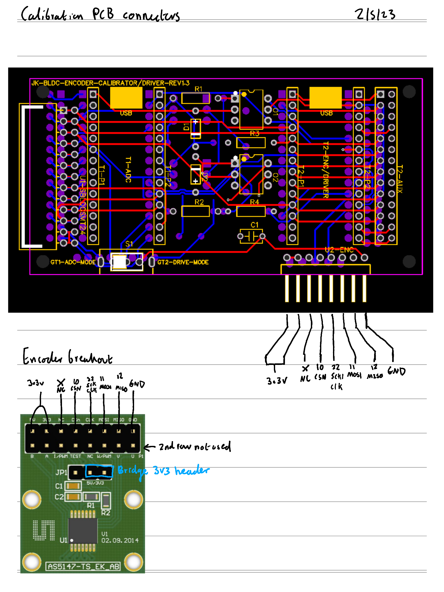

# KAEPEK-CALIBRATION V1.3.0

A calibration library for synchronising bldc motor voltage models with digital absolute position rotary encoders. Note for now this library is only configured for using the AS5147P encoder with [this breakout circuit](https://www.mouser.co.uk/ProductDetail/ams-OSRAM/AS5147P-TS_EK_AB?qs=Rt6VE0PE%2FOfngSpzc2DH8w%3D%3D&mgh=1&vip=1&gclid=Cj0KCQjwm6KUBhC3ARIsACIwxBjypycJOODZLcuEXv6ZZNorVRH8abVcmWROeClnLvezKtGCmwOAK5UaArH_EALw_wcB)

# Galvanically isolated ADC/Encoder circuit

[Circuit](./circuits/calibration/circuit)

## Connecting AS5147P breakout circuit to the calibration circuit

Connection is made by simply connecting a 8 pin header ribbon cable between the encoder and the calibration circuit. See below:

Specific pin connections are mentioned below for reference:

### Encoder information table

AS5147 pin| 5v| 3.3v| x| csn| clk| mosi| miso| GND
:-----:|:-----:|:-----:|:-----:|:-----:|:-----:|:-----:|:-----:|:-----:
Teensy 4.0 #2 pin| 3.3v| 3.3v| x| 10| 22| 11| 12| GND

### Connecting Teensy 4.0 #1 with Teensy 4.0 #2 with two H11L1 optocouplers

Teensy 4.0 #1 acts as a master and sends signals via two galvanically isolated optocouplers to Teensy 4.0 #2. 

### Connection information table

H11L1 #1 RESET pin| 1 (ANODE)| 2 (CATHODE)| 3(NC)| 4(Vo)| 5 (GND)| 6(VCC)
:-----:|:-----:|:-----:|:-----:|:-----:|:-----:|:-----:
Teensy 4.0 #1 pin| 3| GND| X| X| X| X
Teensy 4.0 #2 pin| X| X| X| 3| GND| 3.3V

H11L1 #2 CLK pin| 1 (ANODE)| 2 (CATHODE)| 3(NC)| 4(Vo)| 5 (GND)| 6(VCC)
:-----:|:-----:|:-----:|:-----:|:-----:|:-----:|:-----:
Teensy 4.0 #1 pin| 8| GND| X| X| X| X
Teensy 4.0 #2 pin| X| X| X| 21| GND| 3.3V

# SBLDC-SMT circuit

[Circuit](https://github.com/kaepek/sbldc-smt/tree/e0ab160f8fc606f709ad24c7c99f17e19a991b6a/circuit)

Note that one the voltage divider grid is used for this use case which enables reading voltages from phase A,B,C and the common virtual neutral (VN).

## Connecting KAEPEK-SBDLC-SMT-V2.4.0 circuit to the calibration circuit

Connection is made by simply connecting the 13 pin header from the KAEPEK-SBDLC-SMT-V2.4.0 pcb to the KAEPEK-Calibration circuit pcb with the surface mount components point upwards. 

Specific pin connections are mentioned below for reference:

### ADC/ADC-ETC information table

| PHASE       | A   | B      | VN    | C     |
|-------------|-----|--------|-------|-------|
| Teensy 4.0 #1 pin         | 14  | 15     | 17    | 16    |
| COLOUR      | RED | YELLOW | GREEN | BLACK |
| TRIG        | 0   | 1      | 2     | 3     |
| DONE        | 0   | 1      | 0     | 1     |
| HW-CH       | 1   | 2      | 3     | 4     |
| ADC-CH      | 7   | 8      | 11    | 12    |

### Other pins

- Connect Teensy 4.0 #1 ground to pin 7 of KAEPEK-SBDLC-SMT#V2.4.0

# Collecting ADC Encoder data for calibration instructions

## Prerequisites to collection procedure

Need two computers to collect clean data from this setup. The computer must remain isolated from each other not sharing a ground connection (both cannot have ethernet connecting to the same device, stick to WiFi).

- Install node.js (v18.12.1) and npm (8.19.2) have been checked to work.
- Run `npm install` in the projects root directory.

## Collection procedure

1. Modify zero_crossing_adc.ino and set the PWM_FREQUENCY to full calibration logging speed e.g. 90kHz.
2. Make sure zero_crossing_adc.ino has been loaded onto the Teensy 4.0 #1.
3. Make sure AS5147P_teensy40.ino has been loaded onto the Teensy 4.0 #2.
4. Find network address of computer #1 and computer #2 by running `ifconfig` or similar. e.g. '192.168.0.15'.
5. Plug Teensy 4.0 #2 (Encoder) into computer #2.
6. Plug Teensy 4.0 #1 (ADC) into computer #1
7. Unplug and replug Teensy 4.0 #1 into computer #1 (forcing a reset).
8. Start the network sync program on computer #1 and provide a name for this data collection run e.g. 'aug_18_test_1'. `npm run network-serial:collect-sync --run_id=aug_18_test_1`. 
9. SSH to computer #2.
10. Start the network source program on computer #2. `npm run network-serial:collect-source --device_id=1 --sync_host=10.0.0.110 --seconds_to_collect=2` .
11. Use a power drill to spin the motor at a constant high angular velocity.
12. Start the network source program on computer #1. `npm run network-serial:collect-source --device_id=0 --sync_host=0.0.0.0 --seconds_to_collect=2` .
13. After you are happy enough data has been collected stop collection by unplugging Teensy 4.0 #1.
14. Ensure `network-serial:collect-source` is stopped for both computers. By typing `Ctrl-c` into the relevant terminal sessions.
15. At this point the `network-serial:collect-sync` will merge the dataset and create an output file `./calibration-data/[run_id].jsonl` on computer #1. If this does not work try manually merging the files, see the next section below, otherwise move on to [data analysis section](#data-analysis).

## Manually merging the datasets if network merge fails

1. Each source program will write to the `/tmp` folder before network transmission is attempted. Take the `/tmp/serial-data-device-[x].jsonl` file from the `/tmp` folder's from each computer and place into a folder under `./calibration-data/[experiment-name]/` of computer #1.
2. Combine datasets into a single file `node calibration/combine-multicapture-files.js [experiment-name]`
3. Rename the resultant file the same name as the experiment name `[experiment-name].jsonl` and move to parent folder.
4. Combine the collected `[experiment-name].jsonl` `npm run combine:rotation-voltage-network-data --dataset=[experiment-name].jsonl`, you will recieve a file `[experiment-name].jsonl.matched.csv` if the successful, this program will report how successful it was in matching records high match rate is expect ~98%.
5. Proceed from step 1 from the analysis instructions.

This collection process must be performed for a number of experimental runs for each direction `clockwise` and `counter-clockwise`, I would recommend performing multiple runs in each direction, say atleast 3 in each direction. When performing the [data analysis section](#data-analysis) on each run you may find that some of the runs encountered issues and have artifacts in the collected data, in this case I would recommend repeating the collection process with a set of new experiments to replace the bad captures with good ones.

# Data analysis

Depending on what type of motor controller you are implementing there are different analysis commands you need to run.
The calibration library provides for 3 main types of motor controller:

- 6 step, 3 phase H-Bridge, PWM motor controllers (Trapezoidal Commutation [TC])
- 3 phase H-Bridge, sinusoidal fit (Sinudoidal model fit fom BEMF measurements) PWM motor controllers (Sinusoidal PWM [SPWM])
- 3 phase H-Bridge, direct fit (fit direcly from BEMF measurements) PWM motor controllers (Direct PWM [DPWM])

In either case the raw capture data needs to be combined from the ADC and Encoder microcontroller collected data (for each run) and the result processed to smooth out errors via the [combination and smoothing procedure](#combination-and-smoothing-procedure)

## Prerequisites to performing any Data analysis

- Create a virtual environment: `npm run install:venv`
- Source the virtual environment (must be active before running analysis or for each new terminal session): `source env/bin/activate`
- Install the virtual environment dependancies: `npm run install:venv-deps`

## Combination and smoothing procedure

0. Requires that data has been collected following the [data collection procedure](#collection-procedure)
1. Combine the collected `./calibration-data/[run_id]/raw_capture_data.jsonl` file `npm run combine:rotation-voltage-network-data --run_id=[run_id]`, you will recieve a file `merged_capture_data.csv` in the `./calibration-data/[run_id]` folder if successful, this program will report how well it matched records, high match rate is expect ~98% for good runs. Less than 98% can indicate a loss of sync between the ADC and Encoder microcontroller data recorders, or other issues, try re-running a new trial experiment in this case and abandon the bad data capture.
2. Inspect the `./calibration-data/[run_id]/merged_capture_data.csv` file using the following command and tune the kalman settings at the top of the relevant file `tune-rotation-voltage-data-smoothing.py` (trial and error if nessesary, looking for kalman closely following the signal without to much noise).
    - `npm run inspect:rotation-voltage-data --run_id=[run_id]`
3. When you are happy with the quality of the kalman tuning, you can now commit to smooth the data and save it using the command following (make sure to apply the good Kalman constants from the `tune-rotation-voltage-data-smoothing.py` file to the top of the `smooth-rotation-voltage-data.py` file). This will create a `kalman_smoothed_merged_capture_data.json` file within `./calibration-data/[run_id]` folder, as well as a html report file `kalman_smoothed_merged_capture_data.html`.
    - `npm run smooth:rotation-voltage-data --run_id=[run_id]`
4. Make sure to process inspect the resulting `kalman_smoothed_merged_capture_data.html` file to manually check that there are no artifacts. There are many types of possible artifacts, one channel being higher or lower than the other two channels (indicating a problem with the motor connectors), excessive noise in the data collection (many possible reasons for this, try again), and a loss of sync between the ADC and the Encoder recordings, observable discontinuity in the encoder saw tooth pattern (bad luck! try again).

Examples of good captures:
  - [Good ADC / Encoder capture with Kalman filtering example output of smooth:rotation-voltage-data for a motor with approximately a sinusoidal bemf motor (A2212)](./dist/kalman_smoothed_merged_capture_data.html)
  - [Good ADC / Encoder with a Kalman filtered example output of smooth:rotation-voltage-data for a motor with a trapazodial bemf motor (Tarot 4006)](./dist/kalman_smoothed_merged_capture_data_tarot4006_sept_12_23_cw_3_trapazodial.html)

Examples of bad captures:
  - [Bad capture example 1- High noise](./dist/kalman_smoothed_merged_capture_data_a2212_jul_26_2s_cw_1_high_noise.html)
  - [Bad capture example 2 - One channel higher](./dist/kalman_smoothed_merged_capture_data_a2212_oct_21_cw_1_higher_channel.html)
  - [Sync loss with one channel also higher](./dist/kalman_smoothed_merged_capture_data_a2212_oct_21_ccw_1_sync_loss.html)
  - [Dead channel](./dist/kalman_smoothed_merged_capture_data_a2212_mar_14_2s_cw_dead_channel.html)

For convenience one can run the combination and smoothing process with existing settings (determined by trial and error) using the following command (make sure to check the `kalman_smoothed_merged_capture_data.html` file! This step is not easily automatable):

- `npm run combine-and-smooth:rotation-voltage-data -run_id=[run_id]`

## Fitting procedures:

Then depending on which motor controller you are implementing (TC, SPWM, DPWM) you need to follow the relevant section:

### TC procedure

The TC procdure will map angular segments of the motor to their commutation state. Such that microcontrollers can simply lookup the commutation state based on the angle that the encoder currently sits and therefore apply the correct commutation state as the motor proceeds around the circle. A map is generated for each direction.

The TC procedure require Apache Spark installation v3.5.0 and Spark must be running locally by running the relevant start script e.g. `./spark-3.5.0-bin-hadoop3/sbin/start-all.sh`. Configure the `package.json` spark master url etc.

0. Run the [combination and smoothing procedure](#combination-and-smoothing-procedure)
1. With data now smoothed to minimise zero-crossing detection errors you can apply zero-crossing detection. This will create a `zero_crossing_detections.channels.all.json` which contains grouped lists of angles for each channel cluster e.g. 'zc_channel_af_data' which stands for zero crossing channel phase A falling, where a given phaseA-vn crossed zero. Also a `zero_crossing_detections.histogram.all.json` file will be created which contains any zero crossing events for each channel organised by angle.
  - `npm run detect:zero-crossing --run_id=[run_id]`
2. Now for each channel we should have `motor_poles/2` zero-crossing events, noise will prevent us knowing the exact angle where this happenes, we will in fact have a distribtion of points clustered around `motor_poles/2` centers... thus we can cluster the zero-crossing events into `motor_poles/2` groups. This will create a `kmedoids_clustered_zero_crossing_channel_detections.all.json` files, containing the clustered angles and their centroids (mean points) for each channel.
  - `npm run cluster:zero-crossing --run_id=sept2 --number_of_poles=14`.
3. Next we need to analyse how well the clustering went. Important metrics will be the mean point of each cluster, the standard deviation of each cluster and finally we need a map which identifes for each angle which channel cluster represents that point best if any. The following file is created showing this data `kmedoids_clustered_zero_crossing_channel_detections.all.analysis.json`.
  - `npm run analyse:zero-crossing-channel-clusters --run_id=sept2`
4. Next we need to see the results of the analysis, also we need to use the statistics generated to eliminate cluster outliers a program is provided to do this. A file `zero_crossing_detections.channels.outliers.json` is produced which contains the outliers detected for each channel, a file `zero_crossing_detections.channels.inliers.json` is produces which contain valid inliers per channel and finally a report file `zero_crossing_detections.channels.all.html` is generated to visualise this analysis.
  - `npm run inspect:zero-crossing --run_id=sept2`
5. Next with the outliers removed from the dataset and stored in their own file `zero_crossing_detections.channels.inliers.json`, we need to re-cluster the channels into `motor_poles/2` groups again to create a new file `kmedoids_clustered_zero_crossing_channel_detections.inliers.json`.
  - `npm run cluster-inliers:zero-crossing --run_id=sept2 --number_of_poles=14`
6. Next we need to re-analyse the re-clustered channel zero-crossing angles to create a new analysis file `kmedoids_clustered_zero_crossing_channel_detections.inliers.analysis.json`.
  - `npm run analyse-inliers:zero-crossing-channel-clusters --run_id=sept2`
7. Next we need to see the results of the re-analysis post outlier elimination.
  - `npm run inspect-inliers:zero-crossing --run_id=sept2`

For convenience one can run a single command to perform all off these steps (including the combination and smoothing procedure) for a given `run_id` using the following command:

1. `npm run perform-tc-analysis --run_id=[run_id] --number_of_poles=[number of poles]`

Then after inspecting the analysis for each run and determining a set of `run_id`s which represent good captures (no artifacts) one can then combine the multiple runs together and obtain the analysis reports and resulting fits for the TC procedure:

2. `npm run combine-datasets:zero-crossing-inliers --run_ids=16sept_ccw,16sept_4_cw`

A html file e.g. `combination-report-lqwkwldkjpvgmrbeqcop.html`, an id file e.g.
`combination-report-lqwkwldkjpvgmrbeqcop.id` and a 6 step fit c++ file `commutation_state_lqwkwldkjpvgmrbeqcop.cpp` will be created in the [calibration-data folder](./calibration-data/), `lqwkwldkjpvgmrbeqcop` represents the identifier for the combined set of analysed run results.

### SPWM procedure

The SPWM procedure will take the results from the TC/Smoothing procedure and do its best to fit 3 sinusoids to the data (for each phase), for each direction an angular displacement (degrees away from the 0th encoder step) and an angular phase displacement (the phase seperation between the 3 phases) which leads to the least squares error. Thus the motor constants can be used to create a lookup table within the motor controller so that for each direction the controller can apply an appropriate duty for each phase give an input which is the encoder step at any given time.

1. Peform the same instructions as the [TC procedure section](#tc-procedure)
2. Fit a sinusoid model to the data using either of the following commands:
    - Fit a sine wave to the zero crossing data obtained from the TC procedure: `npm run fit-sine:zc --combination_identifier=lqwkwldkjpvgmrbeqcop --number_of_poles=22`
    - Fit a sine wave to the raw zero crossing data obtained from the TC procedure: `npm run fit-sine:raw --combination_identifier=lqwkwldkjpvgmrbeqcop --number_of_poles=22`

Note the `fit-sine:zc` benefits from significant outlier reduction and so in most cases represents the superior method to obtaining the motor constant fits. Depending on the sinusoidal fit method run one can either obtains the motor constants from the following files in the [calibration folder](./calibration-data/), `zc_reconstruction_lqwkwldkjpvgmrbeqcop.png` which is the output of running the `fit-sine:zc` program or `raw_reconstruction_ynitlldoqesyyvgyuwyg.png` which is the ouput of running the `fit-sine:raw` program.

#### TODO CHECK FILE NAMES

The motor constants and their errors can be obtained in the title of the graph, you can inspect the graphs (the source data and the fit) and compare their extrema to gain some intuition as to the validity of the fit.

Note these methods do assume that the motors are periodically consistant, which is often not the case in reality.

### DPWM procedure

To deal with the inadequacies of the SPWM fitting method arising from the fact that no motors are in fact manufactured perfectly (discrepancies in motor pole strength and inperfect pole spacing) the direct bemf fit method is implemented here. This precedure takes the raw combination data (bemf voltage and angle data) for each run and then superimposes the data (grouped by the encoder angle) and then averages the for each angle the voltage, it applies a normalisation per channel such that one can obtain a single lookup table per direction per phase which informs the motor controller what duty to apply given an input encoder step at any given time. The normalised data can then be loaded into a relevant microcontroller and used the model used to drive the motor forward in a given direction.

This procedure offer the most efficient motor controller model fit of any of the methods proposed here, as the motor phase voltages are played back from direct recordings of the bemf and thus track them quite accurately.

0. Run the [combination and smoothing procedure](#combination-and-smoothing-procedure)
1. Run a direct fit:
    - If you have already run a TC procedure prior to this analysis you may run the following example command: `npm run fit-direct:raw --combination_identifier=lqwkwldkjpvgmrbeqcop`
    - Otherwise you can directly obtain a fit using the following example command: `npm run fit-direct-solo:raw --run_ids=16sept_ccw,16sept_4_cw && npm run graph-direct-solo:raw`, you will obtain an output html, png and c++ file e.g. `combination-direct-fit-ewgtelyqvgfuvropsmif.csv.html`, `raw_reconstruction_direct_comp2_ewgtelyqvgfuvropsmif.png`, `combination-direct-fit-ewgtelyqvgfuvropsmif.cpp`

# Troubleshooting:

- Permission denied when trying to run `network-serial:collect-source`
  - Change permissions for Teensy device `sudo chmod a+rw /dev/ttyACM0`
- One voltage channel 's(A,B,C) peak (in inspect) is larger than the other one.
  - Check circuit connections

# Documentation
Requires running `npm run generate:docs`

- [JS Docs](./docs/global.html)
- Python Docs (TODO)

# 3rd party useful component information:

## H11L1 Opto-isolator

- [Datasheet](https://www.mouser.com/datasheet/2/149/H11L1M-1010369.pdf)

## AS5147P Encoder

- [Datasheet](https://ams.com/documents/20143/36005/AS5147P_DS000328_2-00.pdf)

# Todos:

- Check file names
- Upload examples of bad / good plots
- Re-test everything watch out where i have renamed files outputs
- add disclaimer as to quality

# How to prepare the Teensy40 platform:
- Install [Arduino IDE v1.8.19](https://www.arduino.cc/en/software)
- Install [Teensyduino v2.1.0](https://www.pjrc.com/teensy/teensyduino.html)

# General dependancies:

- [Arduino.h](https://github.com/arduino/ArduinoCore-avr)
- [imxrt.h](https://github.com/PaulStoffregen/cores/tree/master)
- [Serialport](https://github.com/serialport/node-serialport/blob/main/LICENSE)
- [Bokeh](https://github.com/bokeh/bokeh/blob/branch-3.4/LICENSE.txt)
- [Typed struct](https://github.com/sarakusha/typed-struct/blob/main/LICENSE)
- [Extensionless](https://github.com/barhun/extensionless/blob/main/LICENSE)
- [Cross var](https://github.com/elijahmanor/cross-var/blob/master/LICENSE)
- [JS promise socket](https://github.com/dex4er/js-promise-socket)
- [JS Doc](https://github.com/jsdoc/jsdoc/blob/main/LICENSE)
- [Numpy](https://github.com/numpy/numpy/blob/main/LICENSE.txt)
- [Pandas](https://github.com/pandas-dev/pandas)
- [Spark](https://github.com/apache/spark/blob/master/LICENSE)
- [netifaces](https://alastairs-place.net/projects/netifaces/)
- [pyarrow](https://github.com/apache/arrow/blob/main/LICENSE.txt)
- [scipy](https://github.com/scipy/scipy)
- [colour](https://github.com/vaab/colour/blob/master/LICENSE)
- [matplotlib](https://github.com/matplotlib/matplotlib)
